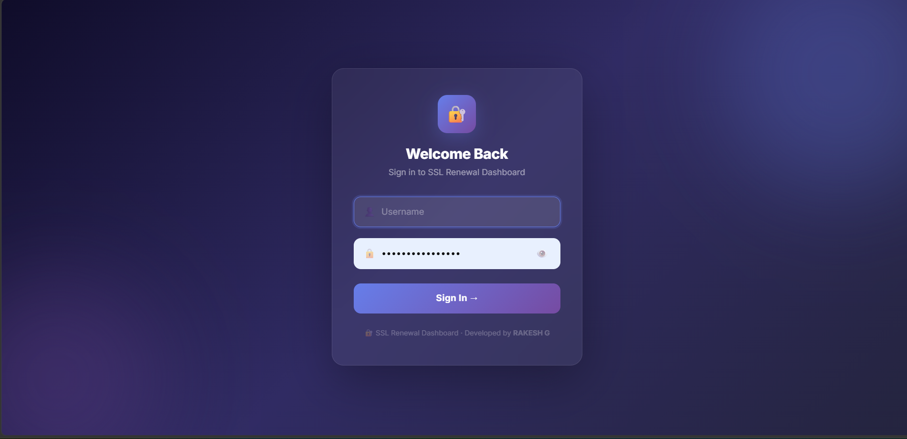
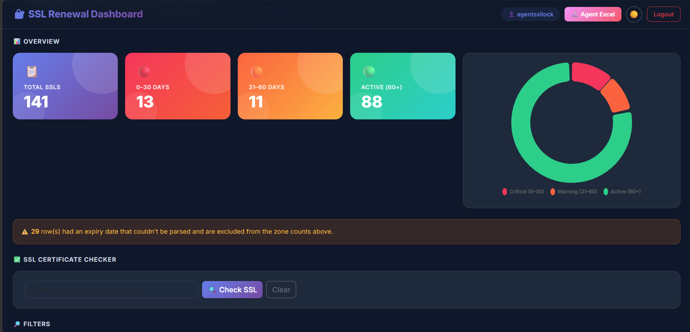
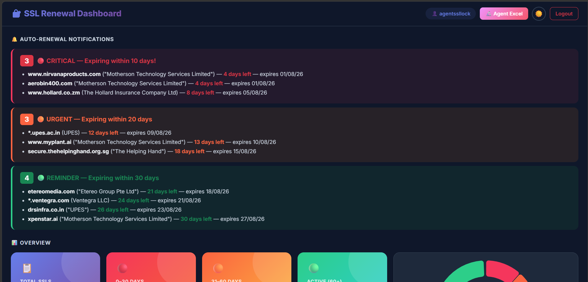
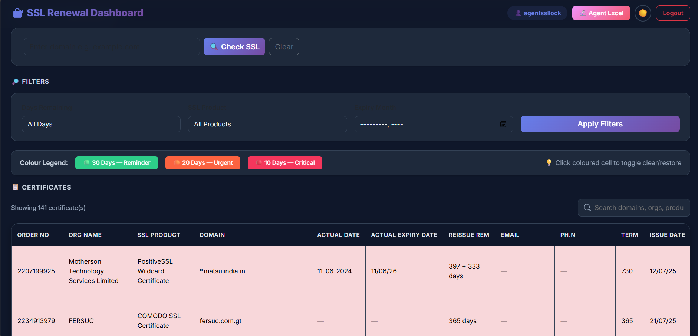
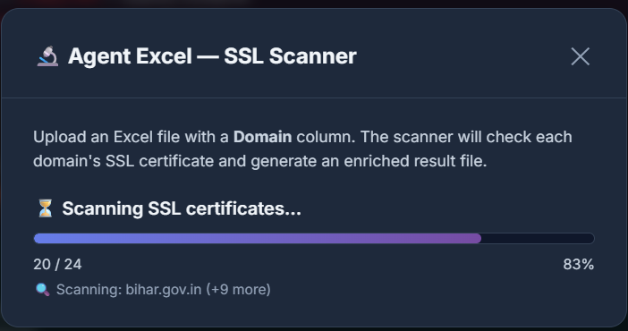
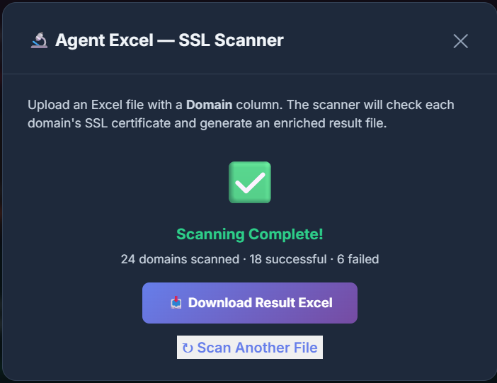

# 🔒 SSL Renewal Dashboard

A full-stack web application for automating SSL certificate monitoring, expiry tracking, and renewal management — built during a Summer Internship at **The SSL Lock**, Chennai (01 June 2026 – 30 July 2026).


---

## 📌 Overview

Organizations managing hundreds of SSL certificates across multiple domains struggle to track expiration dates manually using spreadsheets. This leads to missed renewals, browser security warnings, and potential service disruption.

The **SSL Renewal Dashboard** solves this by providing a centralized platform to monitor certificate validity in real time, automatically scan domains, categorize certificates by renewal urgency, and manage the entire renewal lifecycle from one place.

---

## ✨ Features

- 🔐 **Secure Authentication** — role-based login (Administrator / Agent) with PHP session management
- 📊 **Live Dashboard** — total certificates, expiry buckets (0–30 / 31–60 days), active certificates, and an interactive donut chart
- 🔔 **Auto-Renewal Notifications** — certificates automatically categorized as:
  - 🔴 **Critical** — expiring within 10 days
  - 🟠 **Urgent** — expiring within 20 days
  - 🟢 **Reminder** — expiring within 30 days
- 📁 **Excel/CSV Import** — drag-and-drop upload with automatic data validation
- 🐍 **Python SSL Scanner** — connects to each domain over TLS and extracts:
  - Common Name (CN), Organization, Issuer, Country
  - Issue Date, Expiry Date, Remaining Validity
  - Real-time scan progress with success/fail counts
- ✏️ **Inline Editing** — update renewal status and certificate details via AJAX, no page reloads
- 📤 **Exportable Reports** — download enriched scan results and certificate data as Excel files
- 🔎 **Search & Filter** — filter by days remaining, SSL product, expiry month, or free-text search across domains/orgs
- 🎨 **Modern UI** — dark-themed, glassmorphism login screen with animated background

---

## 🖼️ Screenshots

### Login


### Dashboard Overview


### Auto-Renewal Notifications


### Certificate Management Table


### SSL Scanner — In Progress


### SSL Scanner — Complete


---

## 🛠️ Tech Stack

| Layer | Technology |
|---|---|
| Backend | PHP |
| Database | MySQL |
| Frontend | HTML5, CSS3, Bootstrap 5, JavaScript |
| Async Communication | AJAX |
| Automation | Python (`ssl`, `socket`, `pandas`, `openpyxl`) |
| Charts | Chart.js |
| Excel Handling | SimpleXLSX / SimpleXLSXGen (PHP), SheetJS |
| Local Dev Environment | XAMPP |

---

## 🏗️ System Architecture

The application follows a three-tier architecture:

```
End Users (Admin / Agent)
        │
   Login Authentication
        │
┌───────▼────────────────────────┐
│      PHP Web Application       │
│  • Login Module                │
│  • Dashboard Module            │
│  • Upload Module                │
│  • SSL Management Module        │
│  • Notification Module          │
│  • Reporting Module             │
│  • AJAX APIs                    │
└───────┬─────────────┬──────────┘
        │              │
 Python SSL Scanner   MySQL Database
 (socket, ssl,        (Renewal Status,
  pandas, openpyxl)    Date Overrides,
        │              SSL Info)
        ▼
 SSL Certificate Servers
```

---

## 📦 Project Modules

1. **Login Module** — authentication with session-based access control
2. **Dashboard Module** — summary cards, charts, and notification panels
3. **Upload Module** — Excel/CSV import with validation
4. **SSL Scanner Module** — Python-based automated TLS certificate scanning
5. **Certificate Management Module** — searchable, filterable, inline-editable certificate table
6. **Notification Module** — dynamic categorization by expiry urgency
7. **Reporting Module** — dashboard stats, charts, and downloadable Excel reports

---

## 🗄️ Database Design

**`ssl_renewal_status`**
Domain, certificate status, renewal status, timestamps

**`date_overrides`**
Order number, domain, contact info (email/phone), actual & overridden expiry dates, certificate term

---

## ⚙️ Setup (Local Development)

1. Install [XAMPP](https://www.apachefriends.org/) and start Apache + MySQL
2. Clone this repository into your `htdocs` folder:
   ```bash
   git clone https://github.com/rakesh4407/ssl-renewal-dashboard.git
   ```
3. Create a `config.php` file (not included in this repo) with your local DB credentials:
   ```php
   <?php
   $host = "localhost";
   $username = "root";
   $password = "";
   $dbname = "ssl_dashboard";
   $conn = new mysqli($host, $username, $password, $dbname);
   ```
4. Run `create_db.php` or `setup_db.php` once in your browser to initialize the database tables
5. Install PHP dependencies:
   ```bash
   composer install
   ```
6. Install Python dependencies for the scanner:
   ```bash
   pip install pandas openpyxl
   ```
7. Visit `index.php` in your browser to log in and access the dashboard

---

## 🏢 About The SSL Lock

This project was built for [**The SSL Lock**](https://leads.thessllock.com) — a digital security provider specializing in SSL/TLS certificates, website security, code signing certificates, and enterprise certificate lifecycle management.

---

## 👨‍💻 Developer

**Developed by RAKESH G**
Bachelor of Computer Applications (AI & DS), Semester V
K.R. Mangalam University

Internship at The SSL Lock, Chennai — under the guidance of **Dr. Rupesh Kumar** (University Mentor) and **Muruganandam C** (Senior HR, The SSL Lock)

---

## 📝 Note

This project was developed as part of an academic Summer Internship. Sensitive configuration files and real client data have been excluded from this repository for confidentiality.
